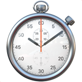

<h1 align="center">lap</h1>  

    

  Simple API to track how long it takes between marks

## API

### lap.mark

- @param `tag`: string
- @return `void`

Begin tracking a new tag. Must be called before you call end.

### lap.end

- @return `{ tag: string, s: number, ms: number }[]`

Ends the last tag, returns an array of how long each tag took in both milliseconds (`ms`) and seconds (`s`). `mark` must have been called once.
